

## The Mayan Cube  
**Mayan Temples with Augmented Reality**

### Abstract

In this work, an Augmented Reality application is described, the Mayan Cube, which provides historical and architectural information about the Mayan culture.  
The six most important Mayan temples were considered: Chichen Itzá, Uxmal, among others.  
The general process involves modeling, animation, and coding to visualize objects in Augmented Reality.

---

## El Cubo Maya  
**Templos Mayas con Realidad Aumentada**

### Resumen

En este trabajo se realiza “El Cubo Maya”, una aplicación de realidad aumentada para proporcionar información histórica, cultural y arquitectónica sobre varias estructuras mayas importantes en la península de Yucatán, tales como la pirámide de Chichen Itzá, la pirámide de Uxmal, el templo de las siete muñecas en Dzibilchaltún, entre otras.  
El proceso involucra el modelado, animación de los modelos 3D, así como la codificación de la aplicación de Realidad Aumentada.

---

**Keywords and phrases**: Realidad Aumentada, Cultura Maya, Arquitectura Maya, Modelado y Animación 3D.  
**2020 Mathematics Subject Classification**: 68U05

<h2>Imágenes del proyecto</h2>

<table align="center">
  <tr>
    <td style="text-align: center;">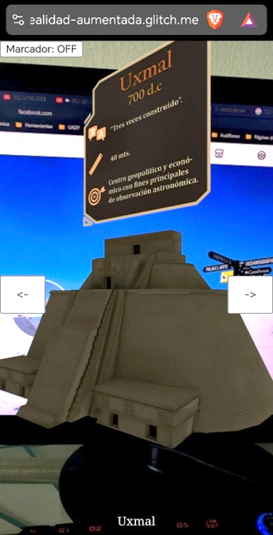</td>
    <td style="text-align: center;">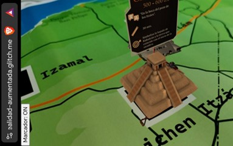</td>
  </tr>
  <tr>
    <td style="text-align: center;">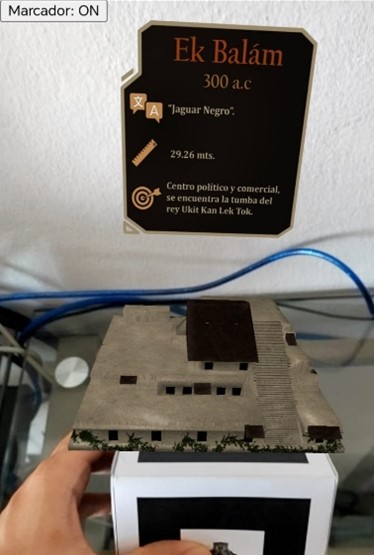</td>
    <td style="text-align: center;">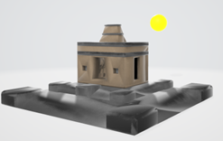</td>
  </tr>
</table>

---

  <h2>Recursos: Plantillas imprimibles o recortables</h2>

  <h3>Cubo Maya</h3>
  

    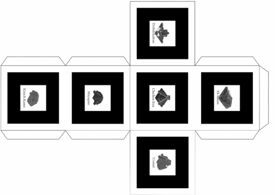
  

  <a href="Documentos_imprimibles/CuboMaya.pdf" download style="display: inline-block; padding: 10px 15px; color: white; background-color: #007bff; border-radius: 5px; text-decoration: none;">
  Descargar
  </a>

  <h3>Mapa de Yucatán</h3>
  

    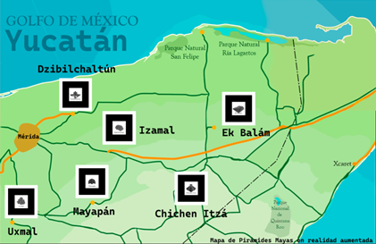
  

  <a href="Documentos_imprimibles/MapaMaya.pdf" download style="display: inline-block; padding: 10px 15px; color: white; background-color: #007bff; border-radius: 5px; text-decoration: none;">
  Descargar
  </a>

<h3>Marcadores</h3>

<table align="center">
  <tr>
    <td style="text-align: center;">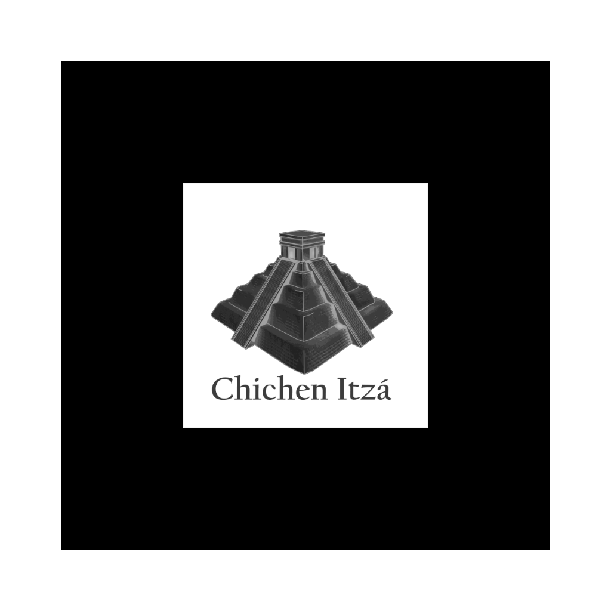</td>
    <td style="text-align: center;">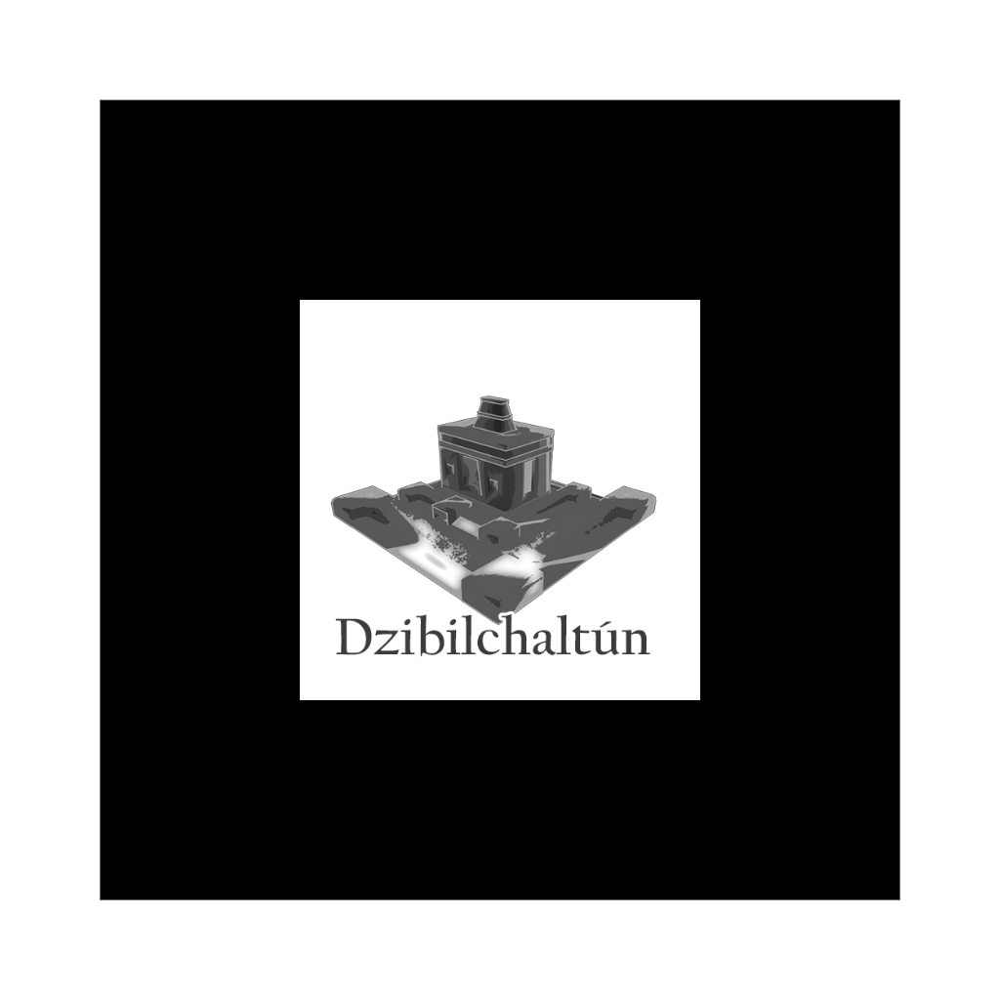</td>
    <td style="text-align: center;">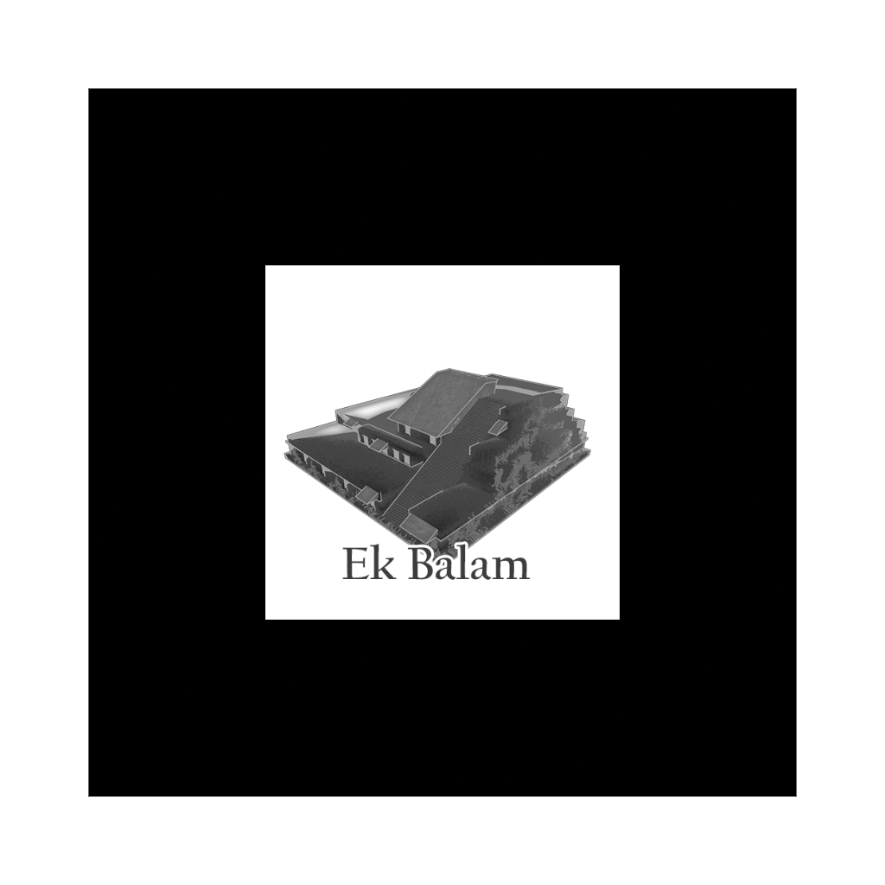</td>
  </tr>
  <tr>
    <td style="text-align: center;"></td>
    <td style="text-align: center;">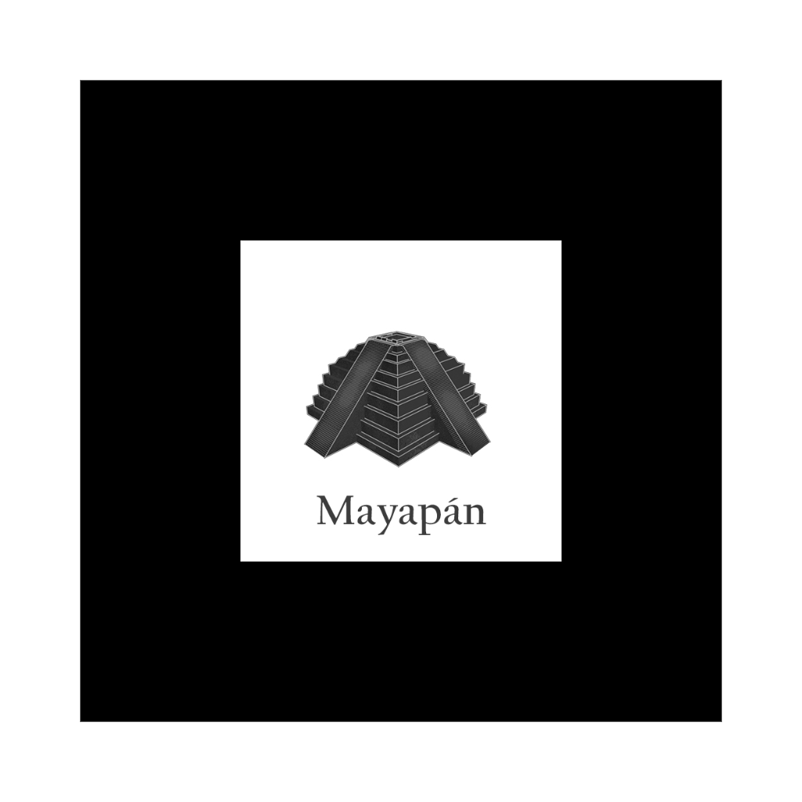</td>
    <td style="text-align: center;">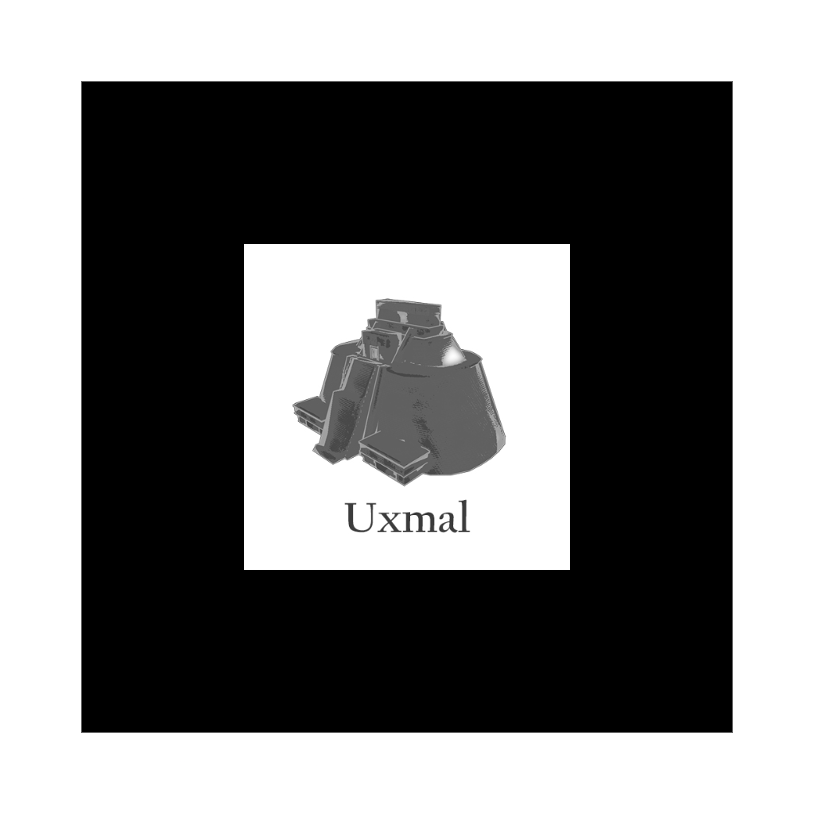</td>
  </tr>
</table>
 <a href="Documentos_imprimibles/Marcadores/" download style="display: inline-block; padding: 10px 15px; color: white; background-color: #007bff; border-radius: 5px; text-decoration: none;">
  Descargar
  </a>
  

